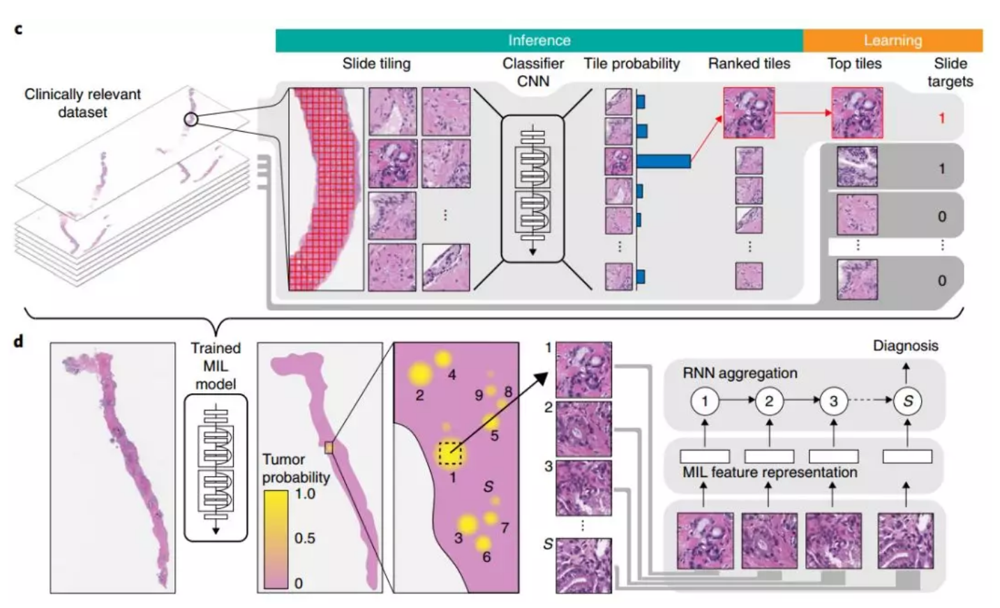

> **全球首个临床级病理 AI 系统源码及复现。**

- **介绍**：[首个临床级病理AI诞生，4万余真实世界病理切片准确率超98%，用于筛查可减少医生75%工作量](https://mp.weixin.qq.com/s/I1mSPWuvSikE-ltS63PK4Q)
- **官方 Github**：https://github.com/MSKCC-Computational-Pathology/MIL-nature-medicine-2019

****

> **个人新增部分**
1. 数据集下载。自己申请的，可直接使用，`50G` 左右。下载[地址](https://pan.baidu.com/s/14FZ5KDpGd-id9rTYtKi5fw)，密码：`i8fv`
2. 数据集准备。官方接口需要指定格式，参考 `code/README.md`。这里我自己写了一个脚本，见 `code/dataPrepare_for_CNN.py` 和 `code/dataPrepare_for_Rnn.py`，改一下相关路径就好。
3. 训练及测试。将官方代码改成单机数据并行训练，加速训练，单 `GPU` 也无需更改代码。具体运行命令，参考 `code/README.md`
4. 具体代码运行流程
   1. 运行：`code/dataPrepare_for_CNN.py`，生成 `MIL` 所需的数据
   2. 运行 `code/MIL_train.py` 和 `code/MIL_test.py`（很慢）
   3. 运行：`code/dataPrepare_for_Rnn.py`，生成 `RNN` 所需的数据（较慢）
   4. 运行 `code/RNN_train.py` 和 `code/RNN_test.py`

****

> **原理图贴一张**

> **结果**

**MIL**

| Pred \ target |  1   |  0   |
| :-----------: | :--: | :--: |
|       1       |   11   |   1   |
|       0       |   2   |   31   |

ACC = 42 / 45 = 93.3%
FNR = 2 / 13 = 15.4%
FPR = 1 / 32 = 3.1%

**RNN**

| Pred \ target |  1   |  0   |
| :-----------: | :--: | :--: |
|       1       |  12  |  1   |
|       0       |  1   |  31  |

ACC = 43 / 45 = 95.6%
FNR = 1 / 13 = 7.7%
FPR = 1 / 32 = 3.1%
